# Install Legacy From Bootable USB

## Introduction

**This is the current recommended method for beginners!**

We recommend beginners to use this method as it is the least error-prone and non-destructive. The following instructions were adapted from the Android-x86 project, so some of the images are from them. To look at Android-x86's original installation guide, [click here.](https://www.android-x86.org/installhowto.html)

## Download Bliss OS

You can download a stable Bliss OS build by clicking on the link [here](https://sourceforge.net/projects/blissos-x86/), non-stable builds can be found [here.](https://sourceforge.net/projects/blissos-x86/)

## Install Bliss OS


If you are looking for a GUI based installer for Windows, we do include one in some of the .ISO's we produce, and we also support the [Supreme-Gamers Advanced Android-x86 Installer](https://supreme-gamers.com/r/advanced-android-x86-installer-for-windows.61/).


When booting into the installer, choose "Installation - Install Android-x86 to harddisk":

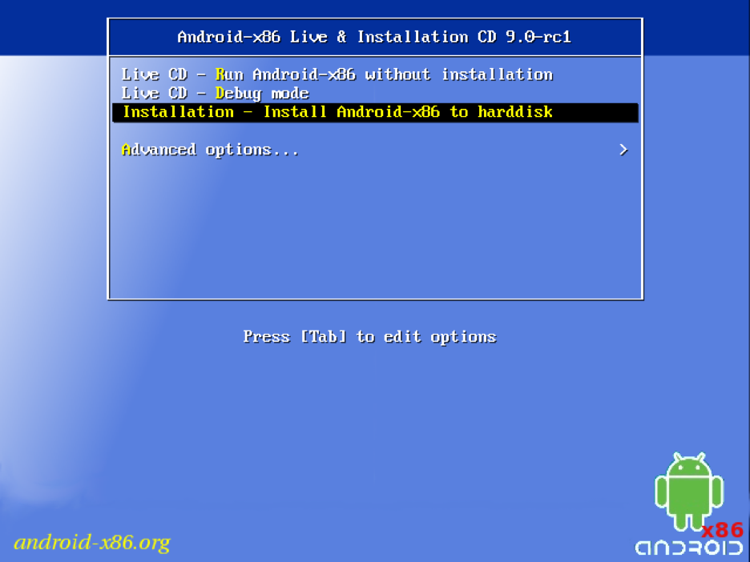

Once the installer boots, you will be asked to select the target drive. Choose the NTFS drive that houses your current Windows install. You do **not** need a separate partition, as the installer will create an image on your Windows partition.

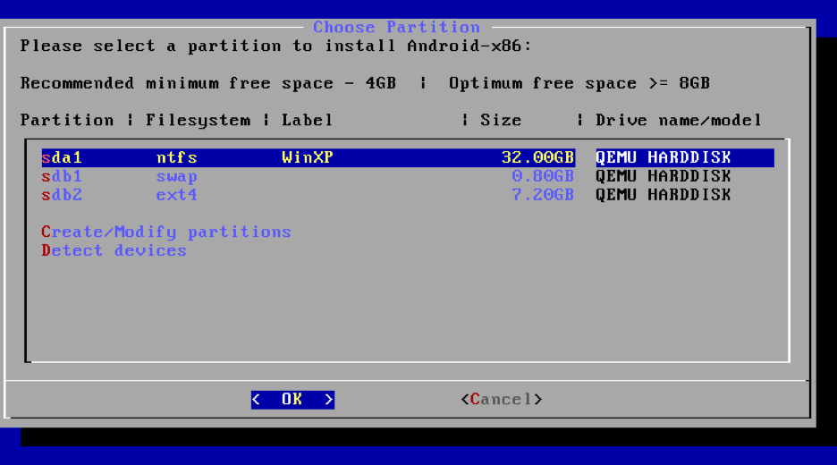

Choose "Do not re-format" on the next screen. It is important that you choose "Do not re-format", as any other option will cause the installer to continue with the ["Bootable installation method"](install-from-bootable-usb.md#bootable-installation-method-mbruefiesp-3264-bit), which **will** result in **permanent data loss**, including your Windows partition!

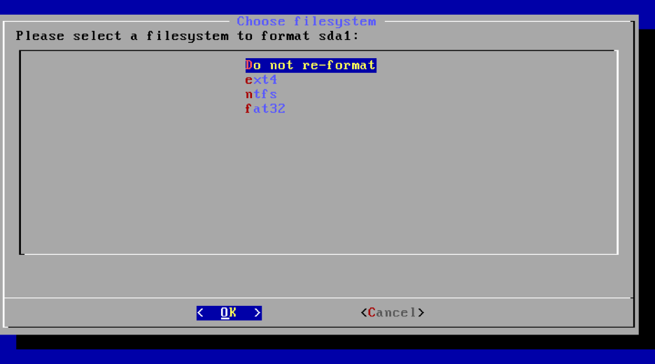

Choose "Yes" when prompted about the `GRUB` bootloader:

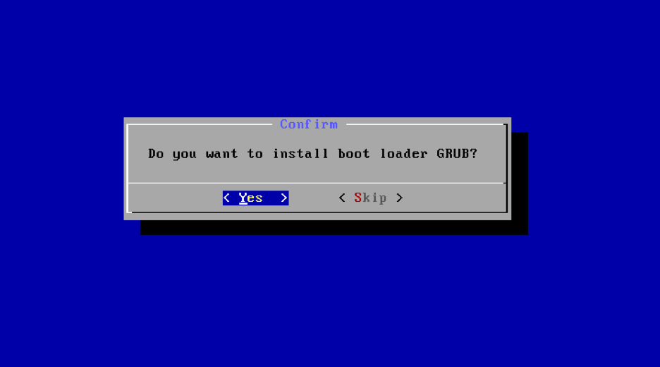

The installer will ask whether or not you want to make the system partition read/write-able. If you want to root your installation, you will choose "Yes" here. Otherwise, choose "No."

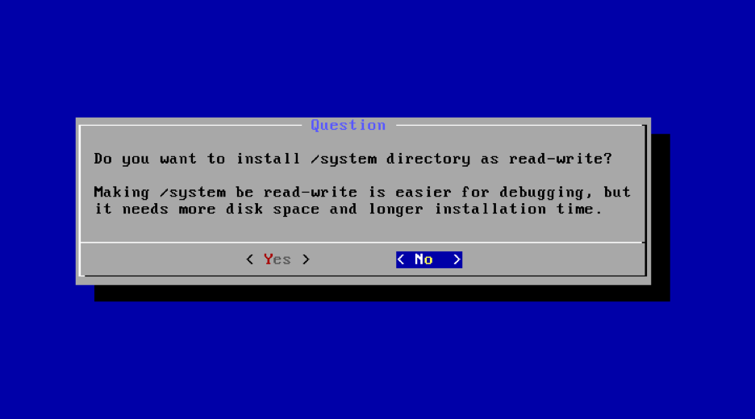

The installer will begin to write the changes to the disk. This will take some time. Go grab a coffee!

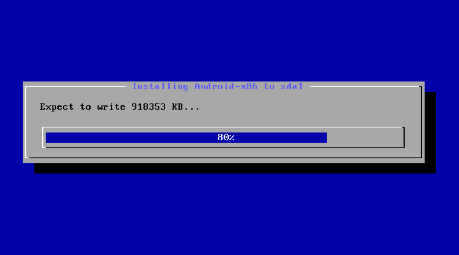

Then the installer will ask you how much space you want to allocate for the data image. Most users choose 8 GB, 16 GB, or 32 GB.

Congratulations! You should now have a functional dual-boot with Bliss OS!

# Install EFI From Bootable USB

## Download Bliss OS

You can download a stable Bliss OS build by clicking on the link [here](https://sourceforge.net/projects/blissos-x86/), non-stable builds can be found [here.](https://sourceforge.net/projects/blissos-x86/)

## Install Bliss OS


If you are looking for a GUI based installer for Windows, we do include one in some of the .ISO's we produce, and we also support the [Supreme-Gamers Advanced Android-x86 Installer](https://supreme-gamers.com/r/advanced-android-x86-installer-for-windows.61/).


When booting into the installer, choose "Android-x86 ... Installation":

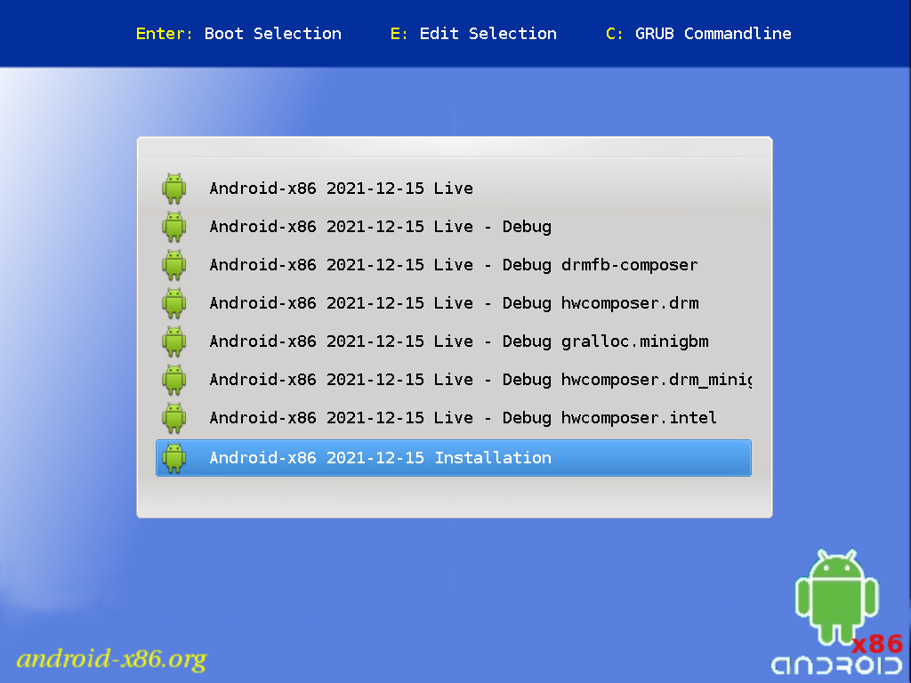

Once the installer boots, you will be asked to select the target drive. You will need to choose what drive to install it too, this could be a pre-existing install of something, or a new drive, shown will be a new drive. you will need to select "Create/Modify partitions" 


WARNING THIS WILL DELETE ANY DATA ON THE DRIVE


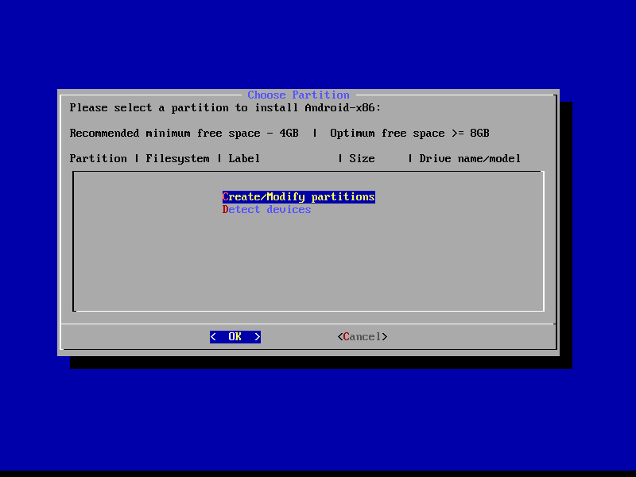

In the next screen, we need to make **two** partiitons for this to work, as Bliss needs to install a bootloader to boot to. if you have a pre-existing install of linux, this step may be unnecessary.

First create the EFI partition, this is the partition that is used to install the bootloader. 

1. Create a [ new ] partition
2. leave First Sector default (Just press enter)
3. for "Size in Sectors" all we need to do is enter `+512M`
4. Leave type as default
5. We don't necessairly need to name this partition, but it is best practice to name it `EFI`

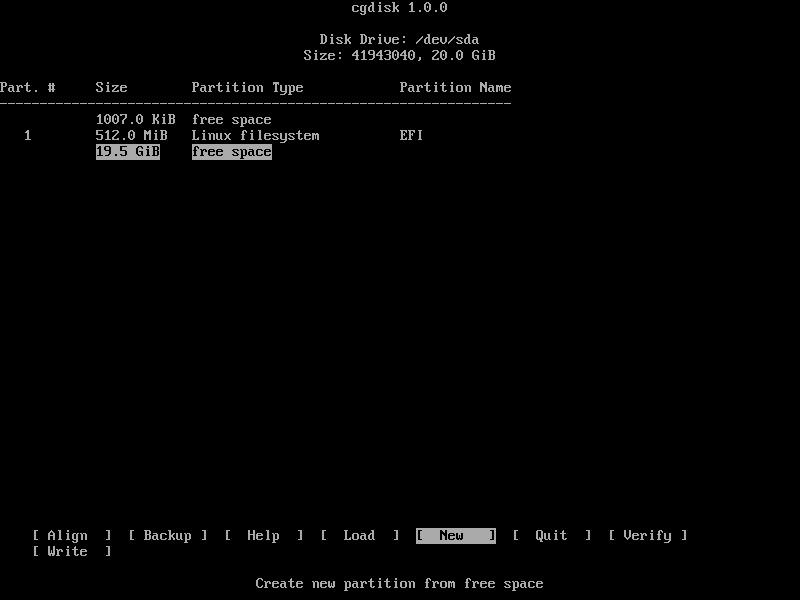

Next we need to make the second partition this is the partition that the bulk of android will be installed to.

1. press down until the largest chunk of free space is slected, and click [ NEW ]
2. We can leave everything default. Although a name is not necesary we can call it ANDROID.
3. Lastly we click [ WRITE ] and [ QUIT ] 

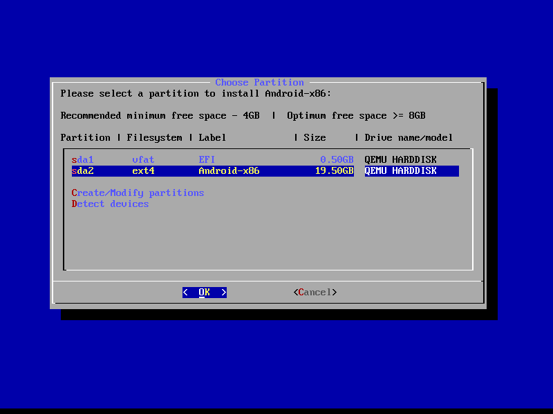

Now that we have the drives partitioned, we can start to install android. Select the ANDROID partition that we have made before, and format it as ext4. this is the recomended format unless windows compatibility is need, in that case select NTFS. and click < Yes > on the next screen

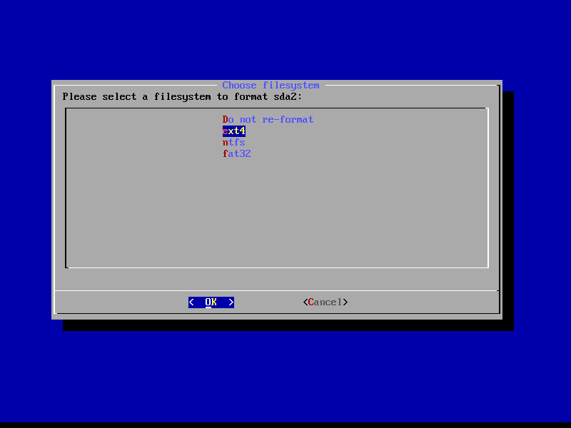
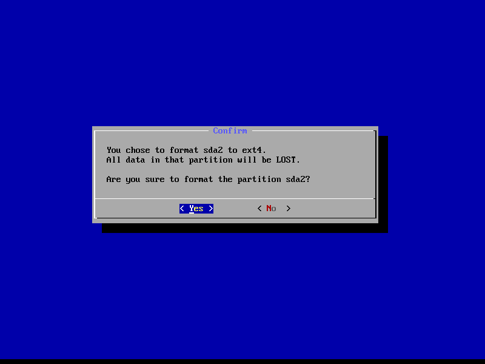

The installer will procede to format and install android, you will then be prompted to install EFI GRUB2. we need to accept that, unless you have a pre-existing grub or other bootloader install

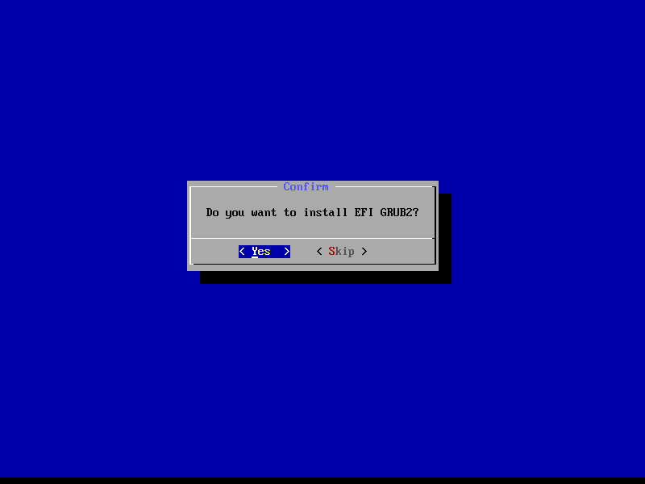

The installer will ask whether or not you want to make the system partition read/write-able. If you want to root your installation, you will choose "Yes" here. Otherwise, choose "No."

And just like with legacy, The installer will begin to write the changes to the disk. This will take some time. Go grab another coffee!

Congratulations! You should now have a functional UEFI-boot with Bliss OS!
